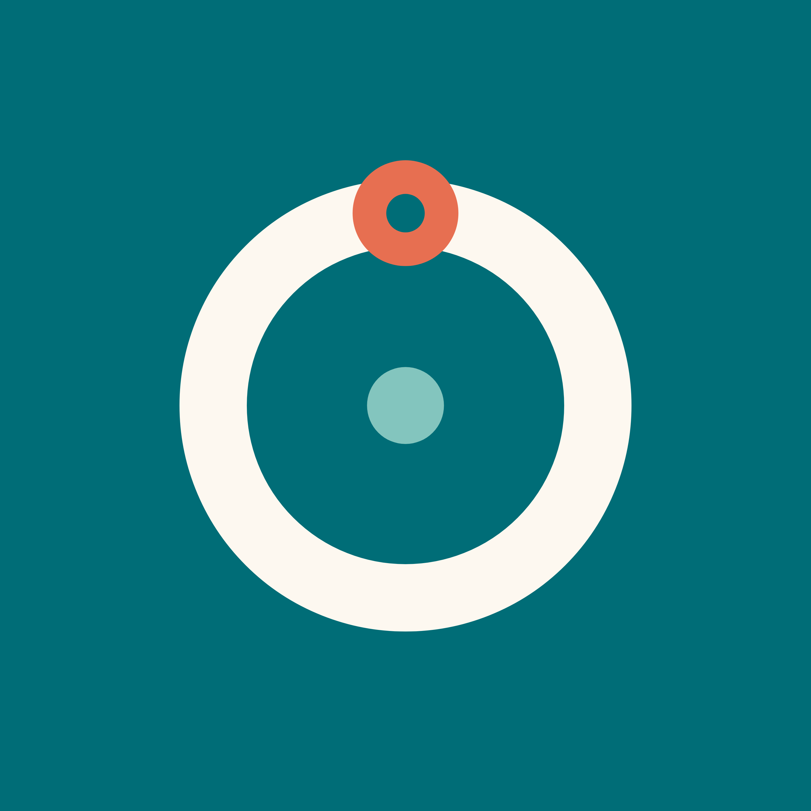

## 🧑‍💻 About Me

- 💻 Freelance **software developer & designer** from **Türkiye**
- 📱 Building mobile apps with **Flutter & Firebase**, web with **Python/Django, PHP & Tailwind**
- 🚀 **Öğrenci Takip Sistemi** is live on the App Store — my education management platform
- 🧭 Currently crafting a **social route & discovery platform** *(private, coming soon)*
- 🎓 Mathematics (Giresun University) · Management Information Systems (İstanbul University)
- ✍️ I write on my [**blog**](https://www.erdiaydindag.com.tr/blog) · all projects at [**erdiaydindag.com.tr**](https://erdiaydindag.com.tr)
- 📫 Reach me: **erdi@aydindag.net.tr**

## 🚀 Live Products

<table align="center">
<tr>
<td align="center" width="110"> <b>ÖTS+</b></td>
<td>

**Öğrenci Takip Sistemi** — Özel ders sürecini tek akışta yöneten eğitim platformu:
ders kaydı, ödev takibi, test istatistikleri, pomodoro odak seansları ve yorumlu veli raporları.
Öğretmen, öğrenci ve veliyi aynı çatıda buluşturur.

</td>
</tr>
<tr>
<td align="center" width="110"> <b>Rovero</b></td>
<td>

**Rovero** — Rotalar, gizli koylar ve keşif hikâyeleri üzerine sosyal bir mobil platform.
Standart bir navigasyon değil, kullanıcıların kendi hikâyelerini anlattığı bir keşif dünyası.

</td>
</tr>
</table>

## 🛠️ Tech Stack

## 📊 GitHub Stats

## 🌐 Connect

